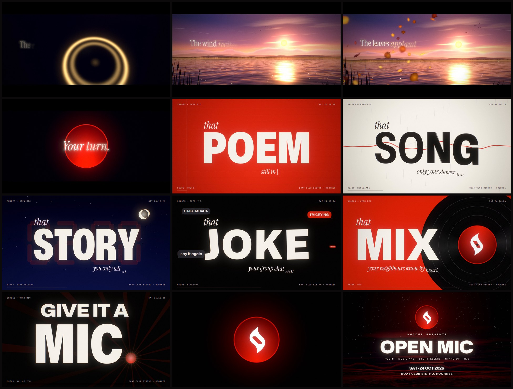

# SHADES — Open Mic · Trailer

A 16.5-second trailer for the **SHADES Open Mic** (poets, musicians,
storytellers, stand-up comics and DJs) — **Saturday 24 October 2026, Boat
Club Bistro, Roorkee**.

Everything is generated in the browser with plain JavaScript: the visuals are
WebGL2 shaders plus Canvas 2D typography, and the soundtrack is synthesised
with the Web Audio API (no samples, no TTS, no stock assets).



## Watch

| File | What it is |
| --- | --- |
| `release/SHADES-OpenMic-Trailer-1080p60.mp4` | 1920×1080, 60 fps, H.264 High + AAC 320k, −14 LUFS / −1.4 dBTP (YouTube, LinkedIn, screens at the venue) |
| `release/SHADES-OpenMic-Trailer-1080p30.mp4` | Same cut at 30 fps (frame-blended) for platforms that prefer it |
| `release/SHADES-OpenMic-Trailer-1080x1920-30.mp4` | Vertical 9:16 cut, 30 fps (Instagram Reels / Stories, WhatsApp status) |
| `dist/SHADES-OpenMic-Trailer.html` | Single self-contained file — double-click to play the live, real-time version |
| `index.html` | Live version for development (serve the folder, see below) |

Live controls: **Space** play/pause · **←/→** seek · **R** restart · **F**
fullscreen. Add `?portrait` to the URL for the 9:16 frame. Without WebGL2 the
page falls back to playing the rendered MP4.

## Structure of the piece

| Time | Section | Idea |
| --- | --- | --- |
| 0.0–5.5 s | Nature performs | A droplet lands on the river at golden hour; the camera rises to the Himalayan horizon. *The river hums. The wind recites. The leaves applaud.* Rustling leaves turn into an audience clapping, the sun becomes the SHADES disc: *Your turn.* Two mic taps. |
| 5.5–10.5 s | The things you keep to yourself | 120 BPM kinetic type. *that POEM still in your notes app · that SONG only your shower has heard · that STORY you only tell at 2 AM · that JOKE your group chat still quotes · that MIX your neighbours know by heart.* |
| 10.5–12.0 s | Climax | **GIVE IT A MIC.** — the red full stop becomes the logo. |
| 12.0–16.5 s | Lockup | The SHADES disc hangs over the night river; event details build beneath it. |

## Run locally

```bash
npm install          # puppeteer-core + esbuild (only needed for tooling)
npm run dev          # static server on http://localhost:5173
```

## Rebuild the deliverables

Requires Chrome/Chromium, ffmpeg and (for font subsetting) fonttools'
`pyftsubset`.

```bash
npm run build                                   # dist/SHADES-OpenMic-Trailer.html
node tools/render.mjs --w=1920 --h=1080 --fps=60 --workers=3   # frames + soundtrack -> dist/*.mp4
node tools/render.mjs --w=960 --h=540 --fps=20 --draft          # quick review draft
node tools/frames.mjs out 5.6 9.9 14.5          # PNG stills at given times
node tools/audio.mjs dist/soundtrack.wav        # soundtrack only (24-bit WAV)
```

Rendering is deterministic: every value is a pure function of time and all
randomness is seeded, so any frame can be re-rendered on its own. Offline
renders average several sub-frame samples for true motion blur. Headless
Chrome needs a software GL backend when there is no GPU; the tools use
`--use-angle=gl-egl --use-gl=angle --disable-gpu-sandbox` (Mesa llvmpipe).
Set `CHROME=/path/to/chrome` to use a different browser binary.

## Editing the copy or event details

All text lives in `src/config.js` (`EVENT` and `COPY`); timings are in the
cue sheet `T` in the same file, shared by the picture and the soundtrack. Key
words re-fit automatically: the Mona Sans width axis is solved so each word
fills the same frame.

## Code map

- `src/gfx/` — WebGL2 pipeline: landscape shader (sky, Himalayan ridges, water
  with droplet rings and sun glitter, the sun that becomes the brand disc),
  compositing, bloom, grade, grain, letterbox.
- `src/scenes/` — `intro.js` (nature), `fast.js` (kinetic type), `end.js`
  (lockup), `director.js` (timeline + post presets), `logo.js` (vector mark
  traced from the supplied logo).
- `src/audio/` — `synth.js` (voices: drums, bass, supersaw, Karplus–Strong
  santoor-like plucks, water, wind, birds, leaves→applause, mic taps, scratch…),
  `score.js` (arrangement locked to the cue sheet), `engine.js` (offline
  render, BS.1770 loudness normalisation, look-ahead limiter, WAV).
- `tools/` — static server, frame/audio/video renderers, single-file build.

## Credits

- Logo: SHADES (vectorised from the supplied artwork).
- Typefaces (SIL Open Font License 1.1): Mona Sans (GitHub), Instrument Serif
  (Instrument), JetBrains Mono (JetBrains).
